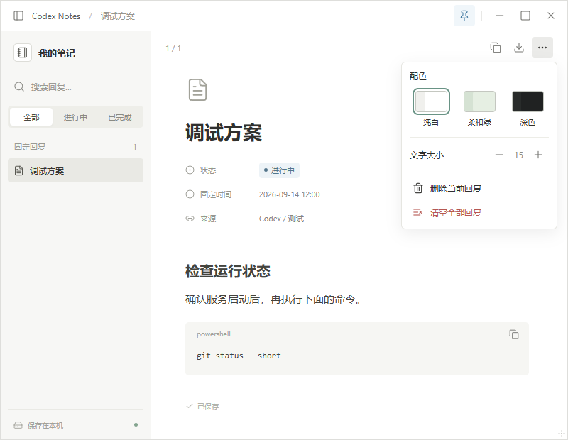
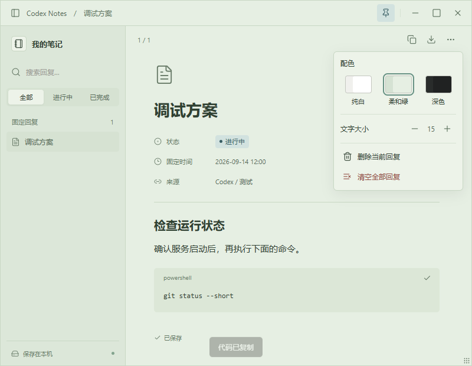
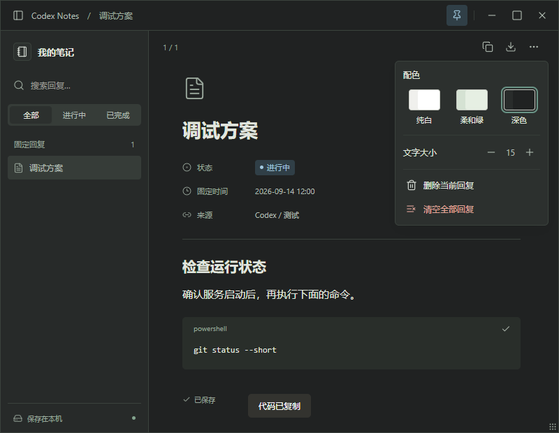

# Codex Notes

A local floating notebook for keeping AI replies visible while you work.

一个面向 AI 工作流的本地悬浮便利贴。把重要回复收进同一个窗口，边工作边查看、复制和整理。



## 功能

- 单窗口多条笔记，标题和来源搜索，进行中 / 已完成筛选。
- Markdown 标题、列表、表格、引用与代码块；代码块独立复制。
- 窗口置顶、拖动、边缘缩放、最大化 / 还原和最小化。
- 纯白、柔和绿、深色配色，字号调整，设置自动保存。
- 导出 Markdown，本机保存；内置图标无需在线 CDN。
- 配套 `pin-reply` Skill，在新的 Codex 对话里说“固定上条回复”。

| 柔和绿 | 深色 |
| --- | --- |
|  |  |

## 环境

目前支持 **Windows 10 / 11**，建议 Python 3.12。此版本是源码安装包，不是免 Python 的 exe 安装器。

需要 [Python 3.10 或更高版本](https://www.python.org/downloads/windows/) 和 [Microsoft Edge WebView2 Runtime](https://developer.microsoft.com/en-us/microsoft-edge/webview2/)。

## 安装

从 GitHub 克隆仓库：

```powershell
git clone https://github.com/huangwenyuan-xx/codex-notes.git
cd codex-notes
```

也可以 [下载源码 ZIP](https://github.com/huangwenyuan-xx/codex-notes/archive/refs/heads/main.zip) 解压。进入包含 `setup.ps1` 的目录，在 PowerShell 运行：

```powershell
powershell -NoProfile -ExecutionPolicy Bypass -File .\setup.ps1
```

安装脚本会在当前目录创建 `.venv` 并下载依赖，同时将 Skill 安装到 `$CODEX_HOME/skills/pin-reply`；未设置 `CODEX_HOME` 时使用 `~/.codex/skills/pin-reply`。不需要管理员权限。已有同名 Skill 会先备份到 `skill-backups`。

这条命令中的 ExecutionPolicy 只作用于该次 PowerShell 进程，不修改系统配置。依赖安装需要联网。

只安装浮窗、不安装 Skill：

```powershell
powershell -NoProfile -ExecutionPolicy Bypass -File .\setup.ps1 -SkipSkill
```

打开浮窗，不添加内容：

```powershell
powershell -NoProfile -ExecutionPolicy Bypass -File .\pin-reply.ps1
```

## 在 Codex 里使用

安装完成后新建对话。等 AI 回复后说：

> 使用 $pin-reply 固定上条回复

也可以说“固定刚才的部署步骤”。“上条回复”指当前对话的上一条完整回答，不会自动指向另一个会话。

旧会话：在原会话里调用 Skill，或让 Codex 查找指定会话中的原文。若只能读取到摘要或截断内容，需提供原文。此工具不直接扫描全部 Codex 历史，不给消息气泡添加按钮，也不把 Skill 当作后台监听器。

如果新对话未发现 Skill，重新打开 Codex 再试。技能入口是 `~/.codex/skills/pin-reply/SKILL.md`（或自定义 CODEX_HOME 中的对应位置）。

## 远程 Linux 会话固定到本机

如果 Codex 任务运行在远程 Linux / 容器中，而你使用 Windows 桌面，运行窗口的仍然是本机。远端只安装 Python 标准库客户端，通过反向 SSH 通道传递选中的回复。

先在 Windows 安装本工具，确认能够用现有 SSH 配置免交互连接目标主机，然后在本机仓库目录运行（将 `your-linux-host` 替换为你的 SSH 别名或 `user@host`）：

```powershell
.\.venv\Scripts\python.exe .\connect_remote.py --host your-linux-host
```

配对器会备份远端旧的 `pin-reply` Skill，安装远程发送入口，并验证从远端到桌面的通道。无需在远端安装 PowerShell、WebView2 或启动 HTTP 网页。

在远端 Codex 对话里重新读取 / 使用 `$pin-reply`，再说“固定上条回复”。收到本机确认后才报告成功。命令行也可以运行远端已安装 Skill 下的 `scripts/pin_remote.py --file reply.md`。

首次配对后，本机后台桥接会自动重连 SSH，并可在收到回复时打开已关闭的笔记窗口。电脑重启后先打开本机 Codex Notes，连接才会恢复；电脑关机或离线时无法投递，客户端会明确报错。不会自动同步全部远端历史。

默认远端端口为 `127.0.0.1:48219`，本机接收端为 `127.0.0.1:48220`。它们只监听回环地址，使用独立配对令牌；SSH 主机密钥必须已验证，服务端须允许端口转发。支持自定义 `--remote-port` / `--local-port`，当前一次配对一个远端主机。无管理员权限或受限容器若不允许回环连接，需在允许连接的宿主运行客户端。

断开并禁用自动恢复：

```powershell
.\.venv\Scripts\python.exe .\connect_remote.py --disconnect
```

本机配对信息保存在笔记数据目录中的 `remote-bridge.json`，远端保存在 Skill 的 `config.json`，均不进入源码包。遇到连接问题查看本机数据目录的 `remote-bridge.log`。这是远程任务到 Windows 桌面的适配，不是 Linux 原生桌面窗口支持。

## 本机命令行

```powershell
# 固定 UTF-8 Markdown 文件，长内容推荐这种方式
.\pin-reply.ps1 -File .\reply.md -Title '部署步骤' -Source '网站任务'

# 固定简短文本；单引号字符串不会执行其中的 PowerShell 表达式
.\pin-reply.ps1 -Text '先运行测试，再部署。'
```

`-Text`、`-File`、`-TextBase64` 三选一。不提供内容时仅打开已有笔记。文本和元数据通过 UTF-8 JSON 传递，不拼接成 shell 命令。

## 数据与迁移

默认数据目录为 `~/.codex/pin-reply-tool`，设置 CODEX_HOME 时改为其下的 `pin-reply-tool`：

- `state.json`：所有笔记、配色、字号和窗口位置。
- `exports/`：导出的 Markdown。
- `startup-error.log`：仅启动失败时写入的错误信息。

数据不在源码目录内，源码 ZIP 不带任何个人笔记。迁移笔记时关闭两边的浮窗，备份目标机器原数据后，再单独迁移数据目录。不要把自己的 state.json 提交到公开仓库。

程序本身没有云同步。点击正文中的网页链接会调用默认浏览器。固定内容为明文存储，同一电脑上的本地进程可访问本地 IPC 端口；本工具不适合作为密码或密钥保险箱。

## 更新与卸载

Git 克隆安装：在仓库目录执行 `git pull`，再运行 `setup.ps1`。关闭旧浮窗后重新打开以载入新版。下载 ZIP 安装：解压新版并运行其安装脚本。

移动源码目录后，运行新目录里的 `install-skill.ps1` 修复 Skill 指向。不要复制 `.venv` 到另一台电脑，应在目标电脑重新运行安装。

卸载时关闭浮窗并移除源码目录和已安装的 `skills/pin-reply` 目录。笔记数据保留；只有确认不再需要时再移除数据目录。

## 开发与打包

```powershell
.\.venv\Scripts\python.exe -m unittest discover -s tests -v
.\.venv\Scripts\python.exe .\pin_reply.py --check
.\.venv\Scripts\python.exe .\scripts\package.py
```

打包器只收集明确列出的源码、Skill、许可证、文档和测试，产物在 `dist/codex-notes-source.zip`，同时生成 SHA-256 校验文件。不会打包 `.venv`、`.git`、缓存、日志或本机笔记。

开发时可用 `CODEX_NOTES_DATA_DIR` 指定独立数据目录、`CODEX_NOTES_PORT` 指定独立本地端口，避免影响日常使用的浮窗。

项目结构：`notes_web.py` 管理本地窗口和笔记；`pin_reply.py` 提供 CLI 和数据工具；`ui/` 是本地网页界面；`skill/` 提供跨会话调用入口。Python 依赖版本固定在 `requirements.txt`。CI 在 Windows 上运行单元测试、脚本语法检查及源码打包检查。

## 许可证

[MIT License](LICENSE)。图标使用 Lucide，其许可见 [THIRD_PARTY_NOTICES.md](THIRD_PARTY_NOTICES.md)。本项目是独立的社区工具，与 OpenAI 或 Notion 无官方关联。
